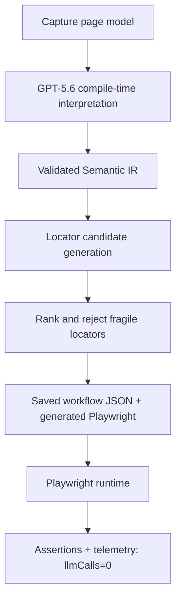
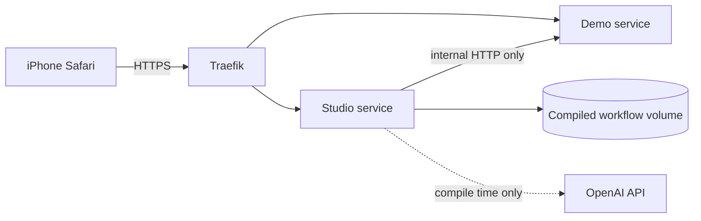

# Architecture

Visual Compiler is a two-phase automation system.

## Compile-Time Boundary

The compiler package may import the OpenAI SDK. It converts natural language and page context into validated semantic steps. Model output is parsed through Zod before being used.

## Runtime Boundary

The runtime package imports Playwright and Zod only. It loads a compiled workflow, resolves semantic locator rules against the live page, executes actions, and verifies postconditions. It never imports OpenAI and does not require `OPENAI_API_KEY`.

Runtime-controlled browser traffic to `openai.com` and its subdomains is aborted.
An attempted request fails the workflow instead of being sent. Successful
telemetry therefore preserves both `llmCalls: 0` and `openAIRequests: 0`.

## Production Topology

The public iframe URL and internal Playwright URL are independent configuration
values. Only Studio receives an optional OpenAI credential. The demo service,
compiled artifacts, client HTML, and runtime telemetry never receive it.

## Locator Ranking

The MVP ranks role/name, label association, text/DOM relation, semantic row/column, stable attributes, DOM relation, spatial bounds, OCR, image template, and absolute coordinate strategies. Only the implemented deterministic strategies execute in the current runtime.
