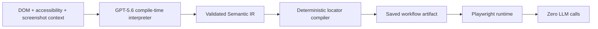

# Visual Compiler

Compile AI once. Execute forever.

Visual Compiler is a Build Week MVP showing that GPT-5.6 can interpret a complex browser instruction at compile time, emit a validated semantic workflow, and replay it later with deterministic Playwright automation and zero runtime model calls.

## Quick Start

```bash
npm install
cp .env.example .env
npm run dev
```

Studio: http://127.0.0.1:3000  
Demo site: http://127.0.0.1:4173/demo?variant=A

Runtime-only demo, no OpenAI key required:

```bash
npm run demo:runtime
```

## Local GPT-5.6 demo on macOS

The local development commands load `.env` automatically. Create it as a plain
text file and keep it readable only by your macOS account:

```bash
cp .env.example .env
chmod 600 .env
nano .env
```

In `nano`, save with `Control-O`, press `Return`, then exit with `Control-X`.
Set `OPENAI_API_KEY`, `USE_LIVE_OPENAI=true`, and
`OPENAI_COMPILE_MODEL=gpt-5.6`. Never paste the key into source code, a browser
form, Git, or a support message.

Run one real compilation followed by deterministic replay on variants A and B:

```bash
npm run demo:live
```

The command sends the page model and instruction to GPT-5.6 once, writes the
validated workflow artifact, removes the API key from the process environment,
then runs both variants with zero OpenAI calls. API billing or credits must be
enabled for the API project that owns the key; a ChatGPT subscription does not
provide API quota.

For the interactive demo, open Studio and click `Run A` or `Run B`. Studio opens
a separate visible Chromium window because Playwright cannot mutate the
independent iframe shown in Safari. Actions run with about 500 ms of slow motion,
and the checked checkbox plus confirmation message remain visible for four
seconds before Chromium closes. The saved workflow is reused, so visible replay
performs zero model and OpenAI network calls. Automated tests continue to request
headless replay explicitly.

## Problem

Browser agents often call a model at every click. That creates latency, cost, nondeterminism, privacy risk, and poor auditability. Traditional automation is deterministic, but it struggles with human spatial instructions like "check the first enabled checkbox to the right of Pending review."

## Solution

Visual Compiler separates intelligence from execution:



## Compile Time vs Runtime

| Stage   | Uses GPT-5.6                     | Requires API key     | Output                                            |
| ------- | -------------------------------- | -------------------- | ------------------------------------------------- |
| Compile | Yes, when `USE_LIVE_OPENAI=true` | Yes for live compile | Semantic IR + ranked locators + Playwright source |
| Runtime | No                               | No                   | Deterministic browser actions + telemetry         |

## Demo Instruction

```text
In the row containing 'Pending review', check the first enabled checkbox to the right of the status text, then click the green confirmation button below the table.
```

The workflow compiles against layout variant A and replays against variants A and B while preserving semantic relationships.

## Supported MVP Actions

`click`, `check`, `uncheck`, `fill`, `select`, `wait`, `assert`.

Supported relations include right of, left of, above, below, same row, same column, nearest, first matching, second matching, enabled-only, and visible-only.

## Repository Structure

```text
apps/demo-site          Controlled page with layout variants A and B
apps/studio             Local studio UI and backend API
packages/semantic-ir    Zod schemas for validated IR
packages/page-model     DOM/accessibility/geometry extraction
packages/spatial        Deterministic geometry utilities
packages/locator-engine Candidate generation and ranking
packages/compiler       GPT-5.6 compile-time interpreter and codegen
packages/runtime        Playwright runtime with no OpenAI dependency
compiled-workflows      Saved deterministic artifacts
tests                   Unit, integration, and E2E tests
DEPLOYMENT.md            Hostinger VPS deployment, update, and rollback guide
```

## Testing

```bash
npm test
npm run test:e2e
```

If Playwright reports that Chromium is missing, run:

```bash
npx playwright install chromium
```

The project pins Playwright and its production browser image to `1.61.1`.

In restricted sandboxes where npm cannot write to `/root/.npm`, use:

```bash
npm --cache /tmp/npm-cache install
```

## Security and Privacy

The runtime package has no OpenAI SDK dependency, compiled workflows do not
store API keys, and runtime telemetry reports `llmCalls: 0`. The runtime also
blocks browser requests to OpenAI hosts and fails the run if a page attempts one.
This project is intended only for authorized browser automation.

## Optional, unvalidated deployment template

The repository includes a production [Dockerfile](Dockerfile) and
[Traefik-compatible Compose template](compose.production.yml). The image contains
the matching Chromium build and Linux dependencies. Compiled workflows are
stored in a named volume.

Production keeps two URLs intentionally separate:

- `DEMO_SITE_INTERNAL_URL` is reachable only by server-side Playwright.
- `DEMO_SITE_PUBLIC_URL` is the HTTPS URL loaded by the Studio iframe.

See [DEPLOYMENT.md](DEPLOYMENT.md) for preparation, health verification,
credential handling, safe updates, backups, and rollback. The template has not
been validated with Docker or deployed to a VPS. Current work is intentionally
limited to the local macOS demonstration.

## Limitations

This MVP is a controlled vertical slice. It does not target arbitrary public websites, CAPTCHA solving, authentication bypass, stealth automation, or high-risk transaction flows.

## Build Week Track

Primary: Developer Tools. Secondary: Work and Productivity, agentic workflows, browser automation infrastructure, testing and RPA tooling.

## How Codex Was Used

Codex designed and implemented the monorepo, deterministic runtime, demo page, schemas, tests, and documentation drafts from the product prompt.

## How GPT-5.6 Is Used

GPT-5.6 is used only during compilation to interpret the instruction into strict validated JSON. Runtime execution loads the compiled artifact and uses Playwright without model access.

## License

MIT.

## Authors

Project authorship placeholder.
